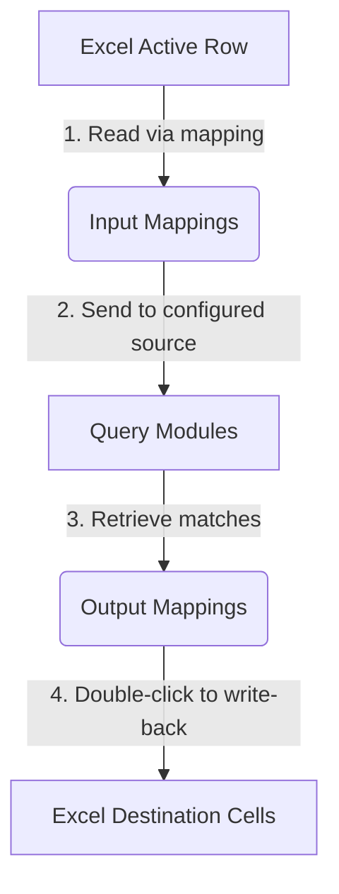

# 🚀 Excel Search Helper — Beginner's Quick Start & Configuration Guide

Welcome to the **Excel Search Helper**! This helper is designed to free you from repetitive manual typing and copy-pasting.
If you find yourself copying values (like "Material Codes" or "Part Names") from an Excel sheet, searching for them in a database or another spreadsheet to get "Inventory, Specs, or Unit Price", and then manually pasting them back one by one — this software is your lifesaver!

---

## 💡 What Can This Software Do? (1-Min Read)

Running silently in your Windows system tray, this software listens for global keyboard shortcuts and provides three powerful core workflows:

| # | Feature | Best For | Description |
| :--- | :--- | :--- | :--- |
| **1** | **Quick Popup Write-Back** | Single-row quick entries | Select a row in Excel, press the hotkey, and a search popup instantly shows matches. **Double-click a row to write the data back into Excel, and the window closes automatically**! |
| **2** | **Advanced Custom Panel** | Flexible filtering & control | Need more control? Press the hotkey to open a panel equipped with text search, numeric ranges, dropdowns, and checkboxes. Navigate your Excel rows and double-click to write-back continuously! |
| **3** | **Batch Auto-Fill** | Handling hundreds/thousands of rows | Select multiple rows in Excel and press the hotkey. The software **automatically queries each row in the background** and batch-fills the top matches into Excel in seconds! |

---

## 🛠️ Step 1: Install and Run

Since the software is built with PyQt5 and interacts with Excel using `xlwings`, your PC only needs to meet these simple requirements:

1. **Operating System**: Windows OS.
2. **Spreadsheet Application**: Microsoft Excel or WPS Office installed (make sure Excel is open and active).

### Quick Launch Steps:
1. **Unzip/Copy the project folder** to any directory on your computer (e.g., `D:\Excel_Helper`).
2. Double-click the `start.bat` file in the folder.
3. You will see a beautiful **spreadsheet icon** appear in your system tray (bottom-right corner of your screen), along with a system notification welcoming you!

---

## 🎯 Experience Center: Try It Out Instantly

To help you get started with zero barriers, we have preloaded a **10,500-row sample spare parts database** (SQLite) and an Excel interaction template!

> [!TIP]
> **Try this walkthrough:**
> 1. Open the file `test/test_interactive_query.xlsx` in your project folder.
> 2. Move your cursor to **Row 6** (A6 contains the material code `6302-2RS`).
> 3. Press the hotkey on your keyboard: `Alt + X`.
> 4. **A miracle happens**: A search window pops up and retrieves 20 matching records from the spare parts database!
> 5. **Write-back**: Simply **double-click any row** in the search window. The "Specs", "Unit Price", "Stock", and "Batch" values will **automatically populate the corresponding Excel cells**, and the popup window will close!

---

## ⚙️ Core Concepts: Customizing the Config

Want to query your own database or Excel lists?
**Right-click** the tray icon and select **Settings** (or simply double-click the icon) to open the interactive settings panel.

The configuration workflow is as simple as a connecting game:

### 1. Query Modules — Data Sources
> Tells the app: **"Where should I look up the data?"**

Under the "Query Modules" tab, you can manage your data sources. Two beginner-friendly formats are supported:
* **Excel File Source (`excel_file`)**: Select any `.xlsx` inventory or product catalog file, and specify which sheet to read (e.g., `Sheet1`).
* **SQLite Database Source (`sql_table`)**: Select a local `.db` database file and specify which table to query.

### 2. Interaction Modules — User Interface
> Tells the app: **"How should my search window look?"**

Customize different search interfaces for different business operations:
* **`search_panel`**: A clean, compact panel with several text input fields.
* **`display_panel`**: A fully customizable panel with dropdowns, numeric ranges, text inputs, checkboxes, and date filters.
* **`auto_fill`**: A background batch-processing runner with no visual popup window.

### 3. Mapping Groups — The Connection Engine
> Tells the app: **"How do Excel columns line up with database columns?"**

This is the most critical link. You are connecting Excel columns with database fields:
* **Input Mappings**: Tells the app which Excel columns to read (e.g., Column `A`) and which search boxes to populate.
* **Output Mappings**: Tells the app which retrieved database fields (e.g., `price`) to write back into which Excel columns (e.g., Column `F`).
* **Display Columns**: Determines which columns are displayed in the results table and how wide they should be.

### 4. Hotkeys — Shortcut Keys
> Tells the app: **"Which keys should trigger this mapping group?"**

Under the "Hotkey Settings" tab, you can assign global hotkeys to your mapping groups:
* e.g., Bind `Alt + X` to your "Parts Inventory Lookup" group.
* e.g., Bind `Alt + A` to your "Auto Batch-Fill" group.
* Once done, click "Save & Close". The app will monitor these hotkeys in the background.

---

## 📝 Troubleshooting & FAQ

> [!WARNING]
> **Q1: I pressed the hotkey but nothing happened, and a popup says "No active Excel sheet found"?**
> * **Answer**: This happens if Excel is not open, or if you are currently inside a cell (active typing or editing a formula). Simply click on a blank cell in your Excel sheet and press the hotkey again.

> [!NOTE]
> **Q2: I double-clicked a row, but no data was written back to Excel?**
> * **Answer**: Please check the **"Output Mappings"** of your Mapping Group. Make sure that each database field is mapped to a valid column letter (e.g., Column `F` for price). Without output mappings, double-clicking only previews the row and does not perform write-backs.

> [!TIP]
> **Q3: Why can't I find my newly created mapping group in the hotkey dropdown menu?**
> * **Answer**: We have resolved this! Now, as soon as you save a mapping group under the "Mapping Group" tab and switch back to "Hotkey Settings", **the dropdown menus instantly refresh and synchronize**, without requiring you to reopen the settings window!

---

Enjoy your automated workflow! If you need advanced configurations or want to extend database backends, please check out the technical [README.md](file:///h:/Program/Excel_Helper/README.md) in the project root!
